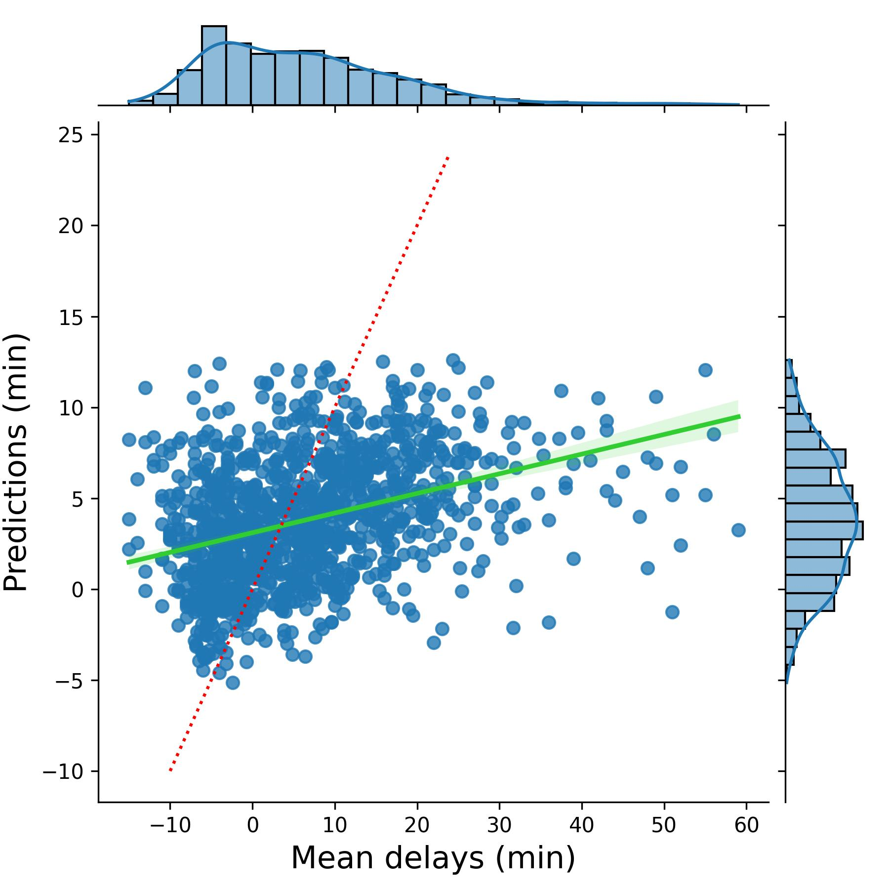

# Flight Delay Prediction API

A backend machine learning application that demonstrates a reproducible workflow for preparing flight delay data, training a polynomial regression model, and serving predictions through a FastAPI REST API.

---

## Overview

This project implements a backend machine learning workflow for predicting airport departure delays. The application imports raw flight data, preprocesses the dataset, trains a polynomial regression model, serializes the trained model, and serves predictions through a REST API.

The training pipeline is reproducible through MLProject, while the deployed API loads the trained model to provide predictions without requiring retraining.

---

## Features

- Automated data import and preprocessing
- Data cleaning and filtering
- Polynomial regression model training
- MLflow experiment tracking
- Serialized model generation (`.pkl`)
- REST API deployment using FastAPI
- Docker container support
- Reproducible machine learning pipeline

---

## Workflow

```text
Raw Flight Data
        │
        ▼
Import & Format
        │
        ▼
Clean & Filter
        │
        ▼
Train Regression Model
        │
        ▼
Serialized Model
        │
        ▼
FastAPI REST API
        │
        ▼
Prediction Response
```

---

## Model Performance



---

## Repository Structure

```text
.
├── src/
├── data/
├── models/
├── logs/
├── images/
├── Dockerfile
├── MLProject
├── pipeline_env.yaml
├── requirements.txt
└── README.md
```

---

## Technologies

| Technology | Purpose |
|------------|----------|
| Python | Backend development |
| Pandas | Data preprocessing |
| Scikit-learn | Machine learning |
| MLflow | Experiment tracking |
| FastAPI | REST API |
| Docker | Containerization |

---

## Running the Training Pipeline

```bash
python3 src/main.py
```

This executes the complete training pipeline by:

1. Importing and formatting the raw dataset.
2. Cleaning and filtering the dataset.
3. Training the regression model.
4. Saving the trained model and encoding artifacts.

---

## Running the API

```bash
uvicorn src.api:app --reload
```

The API loads the serialized model and returns predictions through REST endpoints.

---

## Future Improvements

- Automated retrieval of updated flight data
- Scheduled model retraining
- Model versioning and monitoring
- CI/CD pipeline
- Interactive frontend dashboard
